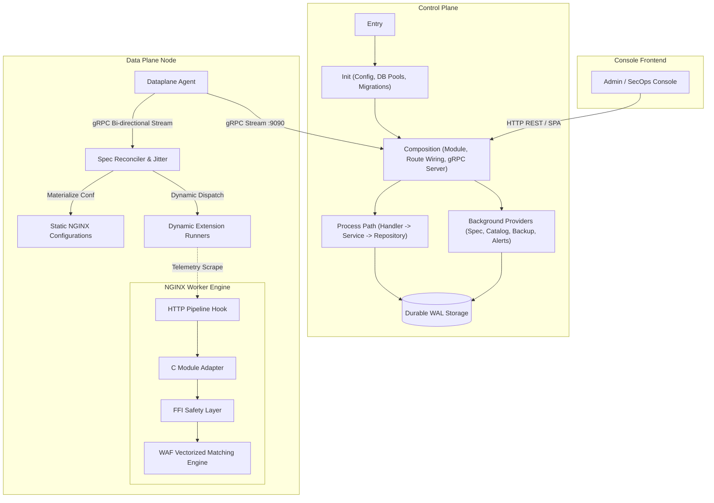

# Kiến Trúc Codebase Aurora API Gateway & WAF (Ma Trận Hệ Thống)

Tài liệu này là **Single Source of Truth (SSOT)** về ranh giới thẩm quyền (authority boundaries), luồng thực thi và ma trận ánh xạ giữa **Object (Mô hình dữ liệu / Khế ước / Snapshot)** và **Behavior (Hành vi / Chuyển dịch trạng thái / Invariants)** xuyên suốt toàn bộ hệ sinh thái Aurora WAF.

---

## 1. Bản Đồ Luồng Tổng Thể (System Architecture Flow)

---

## 2. Control Plane: Ma Trận Vòng Đời Khởi Tạo (Lifecycle Path Matrix)

Mô hình khởi động và chuyển tiếp trạng thái của bộ điều khiển Control Plane:

| Pha Vòng Đời | Object / Context Sở Hữu | Behavior / Nhiệm Vụ Cốt Lõi | Ranh Giới Thẩm Quyền & Invariants |
| :--- | :--- | :--- | :--- |
| **1. Entry** | `AppContext` `OSSignalChannel` | - Tiếp nhận tín hiệu hệ điều hành (`SIGINT`, `SIGTERM`). - Khởi tạo context hủy đồng bộ để đóng toàn bộ subsystem một cách an toàn. | Điểm khởi đầu duy nhất; đảm bảo graceful termination không làm gián đoạn transaction đang commit. |
| **2. Init** | `SystemConfig` `SQLiteWriterPool` `SQLiteReaderPool` `MigrationPlan` | - Đọc và kiểm chuẩn các biến cấu hình hệ thống. - Phân tách ranh giới lưu trữ: **1 Connection Writer độc quyền** (chống xung đột WAL write-lock) và **N Connections Reader đồng thời**. - Thực thi chuỗi migration tự động theo thứ tự nghiêm ngặt: Tables $\to$ Indexes $\to$ Triggers $\to$ Seeds. | Source of Truth của trạng thái bền vững; đảm bảo DB integrity trước khi bất kỳ port nào mở đón traffic. |
| **3. Composition** | `ModuleContainer` `HTTPRouter` `GRPCServer` `ProviderRegistry` | - Wire toàn bộ quan hệ phụ thuộc: Repository $\to$ Service $\to$ Handler. - Gắn các middleware bảo mật: Bearer Auth, CORS, Strict Security Headers, SPA Fallback Handler. - Mở socket gRPC Stream phục vụ Data Plane spec replication. - Đăng ký và kích hoạt các Background Worker Providers. | Vùng composition gốc; tuyệt đối không để rò rỉ Business Logic vào tầng liên kết phụ thuộc. |
| **4. Process Path** | `RequestContext` `CommandDTO` `ResultProjection` | - Thực thi nghiệp vụ theo luồng đơn hướng: `Handler` (Transport/Validation) $\rightarrow$ `Service` (Business Rules/Invariants) $\rightarrow$ `Repository` (CTE-First SQL Query). | Workflow Isolation: Mỗi nghiệp vụ có DTO, Service Port và Repository Port riêng biệt; không dùng chung Entity chéo. |

---

## 3. Control Plane: Ma Trận Nghiệp Vụ (Object $\leftrightarrow$ Behavior Matrix)

| Phân Vùng Nghiệp Vụ | Core Objects (Entities / DTOs / Payloads) | Behaviors (Hành Vi & Chức Năng Cốt Lõi) | Authority Boundary, Durable State & Invariants |
| :--- | :--- | :--- | :--- |
| **Spec & Cluster State** | `ClusterSpecRecord` `ClusterSpecSnapshot` `SpecReleaseCommand` `SpecReleaseDigest` | - `GetHeadSpec()`: Đọc snapshot cấu hình đang kích hoạt. - `GenerateSpecSnapshot()`: Biên dịch toàn bộ trạng thái DB thành 1 file YAML hợp nhất. - `PublishRelease()`: Sinh băm SHA-256 digest và ghi sổ cái bất biến. - `RollbackSpec()`: Kích hoạt phiên bản snapshot lịch sử đã kiểm chứng. | **Bảng `cluster_spec_releases` & `cluster_spec_head`**. Invariants: Mọi bản phát hành là bất biến (immutable) qua Database Triggers. Cấm update/delete release đã sinh. |
| **gRPC Node Spec Stream** | `WatchSpecRequest` `SpecReleaseChunk` `NodeHeartbeat` `StreamAck` | - `WatchSpec()`: Mở luồng Server-Streaming gRPC đẩy spec mới tới Edge Nodes. - `Heartbeat()`: Ghi nhận nhịp tim, phiên bản và telemetry từ agent. - `AcknowledgeRelease()`: Xác nhận node đã biên dịch và nạp cấu hình thành công. | **Bảng `cluster_nodes`**. Invariants: Phát hiện drift trạng thái nếu `observed_release_id` lệch với `head_release_id`. |
| **Extensions Catalog** | `ExtensionItem` `ExtensionRule` `ExtensionConfigUpdate` `CatalogSchema` | - `ListExtensions()`: Lấy danh mục 115+ plugins. - `UpdateConfig()`: Cập nhật JSON cấu hình và rules tùy biến theo từng extension. - `ToggleStatus()`: Bật / Tắt tức thì plugin. - `TriggerSpecReconciliation()`: Phát tín hiệu biên dịch spec mới khi cấu hình extension đổi. | **Bảng `extensions`**. Invariants: Config JSON phải thỏa mãn json_valid constraint và tương thích với dynamic runners của Agent. |
| **Domains & TLS** | `DomainRecord` `CreateDomainCommand` `UpdateDomainCommand` `DomainBinding` | - `CreateDomain()`, `UpdateDomain()`, `DeleteDomain()`. - `ValidateDomainBinding()`: Kiểm tra upstream đích có tồn tại hợp lệ hay không. - `EnforceTLSProfile()`: Cấu hình min_tls_version, HSTS, OCSP stapling. | **Bảng `domains`**. Invariants: Tên miền là duy nhất (`UNIQUE(domain)`). Không cho phép domain trỏ tới upstream rỗng. |
| **Upstreams Topology** | `UpstreamRecord` `UpstreamServer` `HealthCheckPolicy` `UpstreamRelease` | - `CreateUpstream()`, `UpdateUpstream()`. - `CompileUpstreamTopology()`: Tính toán danh sách backend servers, weights và thuật toán load balancing (`round_robin`, `ip_hash`, `least_conn`). - `RecordNodeSync()`: Theo dõi pha nạp upstream của node. | **Bảng `upstreams`, `upstream_releases`, `upstream_node_sync`**. Invariants: Không xóa upstream đang được một hoặc nhiều domain kích hoạt tham chiếu tới. |
| **WAF Rules Core** | `RuleItem` `RuleRevision` `CreateRuleCommand` `RuleDefinition` | - `CreateRule()`, `UpdateRule()`: Tạo quy tắc và snapshot version bất biến. - `CompileRuleset()`: Gọi binary compiler sinh snapshot nhị phân WAF. - `FreezeRevision()`: Đóng băng revision của quy tắc khi phát hành ruleset. | **Bảng `rules`, `rule_revisions`, `ruleset_releases`, `rule_definitions`**. Invariants: Revisions có tính append-only, có trigger chặn sửa đổi/xóa lịch sử. |
| **Access Control (IP/CIDR)** | `AccessObject` `AccessRevision` `AccessRelease` `AccessMatchEvent` | - `ApplyChanges()`: Thêm/sửa/xóa quy tắc CIDR/ASN dạng flat entity. - `Desired()`: Cung cấp snapshot access rule cho node. - `RecordViolation()`: Ghi nhận sự kiện chặn IP vi phạm theo node_id. | **Bảng `access_objects`, `access_revisions`, `access_releases`, `access_events`**. Invariants: Kiểm tra tính hợp lệ của dải CIDR trước khi commit transaction. |
| **Cluster Nodes** | `ClusterNodeRecord` `NodeHeartbeatPayload` `NodeDirective` | - `RegisterNode()`: Tự động đăng ký node mới khi nhận heartbeat hợp lệ. - `TriggerReload()`: Đưa lệnh reload vào hàng đợi rolling reload. - `DrainNode()`: Đánh dấu trạng thái Draining để chuyển hướng traffic. | **Bảng `cluster_nodes`, `node_sync_logs`**. Invariants: Node không gửi nhịp tim quá 60 giây sẽ tự động chuyển trạng thái `Not Ready`. |
| **Analytics Explorer** | `AnalyticsQuery` `MetricSeries` `TimeSeriesPoint` `NodeMetricsSnapshot` | - `QueryMetrics()`: Phân giải số liệu thống kê. - `IngestNodeMetrics()`: Lưu trữ CPU, RAM, active connections, RPS định kỳ. - `RouteTelemetryBackend()`: Chuyển đổi linh hoạt giữa SQLite Rollup và Prometheus API. | **Bảng `node_metrics_history` kết hợp Prometheus Server**. Invariants: Không làm nghẽn luồng xử lý chính khi hệ thống telemetry bên ngoài quá tải. |
| **Security & Auth** | `UserRecord` `AuthProviderItem` `LoginCommand` `TOTPValidation` | - `Authenticate()`: Kiểm tra mật khẩu mã hóa Argon2id. - `VerifyTwoFactor()`: Xác thực mã 6 chữ số TOTP RFC 6238. - `ConfigureProvider()`: Bật/tắt OIDC SSO, LDAP, SAML. | **Bảng `users`, `auth_providers`, `system_settings`**. Invariants: Tài khoản admin không được phép xóa; mật khẩu lưu trữ kèm muối (salt) ngẫu nhiên. |
| **Notifications & Alerts** | `NotificationChannel` `NotificationRule` `AlertMessage` `DispatchQueue` | - `EnqueueAlert()`: Đẩy thông báo sự cố vào hàng đợi bất đồng bộ. - `TestChannel()`: Kiểm tra độ sống của Webhook, Telegram, Slack, Discord, Email. - `FormatPayload()`: Định dạng payload theo cú pháp riêng của từng kênh. | **Bảng `notification_channels`, `notification_rules`**. Invariants: Hàng đợi cảnh báo giới hạn kích thước (bounded buffer) tránh tràn bộ nhớ khi mạng nghẽn. |
| **Backup & Disaster Recovery** | `BackupSettings` `BackupHistoryRecord` `BackupArchive` | - `CreateBackup()`: Khóa snapshot SQLite an toàn và nén archive. - `UploadToS3()`: Đẩy tệp sao lưu sang S3/MinIO bucket. - `RestoreBackup()`: Khôi phục toàn diện database từ snapshot đã lưu. | **Bảng `backup_settings`, `backup_history`**. Invariants: Tự động dọn dẹp các bản backup cũ vượt quá thời hạn retention quy định. |

---

## 4. Control Plane: Ma Trận Background Providers & Workers

| Provider Worker | Quản Lý Trạng Thái (State Object) | Chu Kỳ / Sự Kiện Kích Hoạt | Behavior & Trách Nhiệm Vận Hành |
| :--- | :--- | :--- | :--- |
| **SpecScheduler** | `SpecReconciliationState` `TriggerChannel` | - Chu kỳ định kỳ (10 giây). - Hoặc kích hoạt ngay tức thì khi có mutation từ API. | Quét DB, tổng hợp toàn bộ Spec, băm SHA-256; nếu digest khác biệt thì tạo release mới và notify tới toàn bộ kênh gRPC streams. |
| **CatalogProvider** | `DynamicExtensionRegistry` `JSONSchemaValidator` | Khởi chạy hệ thống lúc bootstrap. | Tải danh mục 115+ plugins, đối chiếu schema JSON cấu hình mặc định, đồng bộ vào bảng lưu trữ extensions. |
| **AnalyticsProvider** | `TelemetryStrategyContext` `PrometheusClient` | Mỗi khi nhận yêu cầu truy vấn metrics. | Điều phối nguồn dữ liệu: truy vấn trực tiếp từ bảng rollup lịch sử hoặc gửi PromQL ngược dòng sang máy chủ Prometheus. |
| **BackupScheduler** | `CronScheduleContext` `StorageTarget` | Theo lịch biểu Cron (mặc định: `0 2 * * *`). | Chụp snapshot database dạng Online Backup không khóa bảng đọc, nén và đẩy lên kho lưu trữ cục bộ hoặc cloud S3. |
| **NotificationWorker** | `AlertDispatcherQueue` `RetryBackoffPolicy` | Bất đồng bộ liên tục qua Channel buffer (256 slots). | Rút thông điệp cảnh báo từ hàng đợi, phân phối theo các kênh kích hoạt tương ứng, xử lý retry với exponential backoff. |

---

## 5. Rust Dataplane Agent: Ma Trận Phân Vùng Kiến Trúc

| Phân Vùng | Core Objects & Structs | Behaviors & State Transitions | Invariants & Nguyên Tắc Bảo Vệ |
| :--- | :--- | :--- | :--- |
| **Bootstrap & Config** | `AgentRuntimeContext` `AgentCliFlags` | - `bootstrap()`: Đọc tham số `--controller-url`, `--node-id`, `--auth-token`. - `ensure_environment()`: Tạo các thư mục cấu hình và tệp upstreams rỗng ban đầu. - `spawn_workers()`: Khởi động song song Spec Sync, Heartbeat và Telemetry tasks. | Ngăn chặn khởi động nếu thiếu token xác thực hoặc không phân giải được địa chỉ Controller. |
| **gRPC Spec Sync** | `GrpcStreamClient` `SpecReleaseWatcher` `SpecStreamChunk` | - `connect_stream()`: Thiết lập kênh kết nối gRPC hai chiều với Controller. - `receive_spec()`: Nhận dữ liệu stream spec YAML. - `verify_digest()`: Đối chiếu SHA-256 digest của spec nhận được với release hiện hành. | Giữ kết nối persistent; tự động kết nối lại (reconnect loop) khi mạng ngắt quãng. |
| **Reconciler & Jitter** | `ReconcileEngine` `JitterTimer` | - `evaluate_diff()`: So sánh cấu hình cũ và mới. - `apply_jitter()`: **Chờ ngẫu nhiên từ 0 đến 2500ms** trước khi áp dụng cấu hình xuống NGINX. - `report_status()`: Phản hồi trạng thái nạp spec về Controller qua gRPC. | **Chống Thundering Herd**: Triệt tiêu hiện tượng toàn bộ cluster reload NGINX đồng thời làm sụt áp origin. |
| **Materializer** | `NginxManager` `MaterializePlan` `UpstreamConf` `RoutingConf` | - `materialize()`: Chuyển hóa AST của Spec thành cấu hình NGINX tĩnh. - `validate()`: Thực thi lệnh `nginx -t` kiểm tra cú pháp. - `hot_reload()`: Thực thi `nginx -s reload` nạp cấu hình không rớt TCP sessions. - `rollback()`: Phục hồi cấu hình cũ nếu `nginx -t` trả về lỗi. | **Zero-Downtime Guarantee**: Nếu file cấu hình mới sinh lỗi cú pháp, NGINX giữ nguyên tiến trình cũ, không reload. |
| **Heartbeat Worker** | `HeartbeatTask` `NodeTelemetryReport` | - `collect_host_metrics()`: Thu thập mức sử dụng CPU, RAM và active connections. - `send_heartbeat()`: Gửi nhịp tim kèm release ID đang nạp tới Controller mỗi 10s. - `handle_command()`: Tiếp nhận và thực thi các chỉ thị cưỡng chế (reload, drain). | Đảm bảo Controller luôn nắm bắt chính xác trạng thái thực thi của từng edge node. |
| **Extension Dispatcher**| `ExtensionDispatcher` `DynamicRunnerMap` `ExtensionSpecValue` | - `apply_spec()`: Duyệt qua danh sách dynamic extensions trong Spec. - `start_runner()`: Khởi chạy worker task cho các extension được bật (Bot challenge, distributed rate limiter). - `stop_runner()`: Hủy bỏ worker task khi extension bị vô hiệu hóa trong Spec. | Cho phép bật/tắt logic extension động trong bộ nhớ Agent mà không cần khởi động lại tiến trình daemon. |
| **Telemetry Exporters** | `MetricsCollector` `PrometheusPullServer` `OtlpPushClient` | - `scrape_stub_status()`: Đọc số liệu từ NGINX internal stub status. - `serve_prometheus()`: Cung cấp HTTP endpoint `:9145/metrics` chuẩn Prometheus format. - `push_otlp()`: Đẩy traces/metrics sang OpenTelemetry collector theo chu kỳ. | Không tạo overhead vượt quá 1% CPU của node; phục vụ số liệu không khóa luồng chính. |

---

## 6. WAF Engine & NGINX FFI: Ma Trận Thực Thi Gói Tin

| Thành Phần | Data Buffers & Memory Models | Behaviors & Thuật Toán Xử Lý | Ranh Giới Bộ Nhớ & Thực Thi |
| :--- | :--- | :--- | :--- |
| **WAF Engine Core** | `CompiledRuleset` `AhoCorasickAutomaton` `HyperscanDatabase` `RuleMatchResult` | - `build_automaton()`: Xây dựng máy trạng thái hữu hạn Aho-Corasick cho hàng nghìn chuỗi mẫu. - `match_payload()`: Quét đồng thời các thành phần HTTP (URI, Headers, Query, Body). - `evaluate_score()`: Tổng hợp điểm số bất thường (anomaly scoring) để đưa ra hành vi (Allow, Log, Block). | Thực thi hoàn toàn trong RAM; tốc độ tính toán vector hóa đạt hàng trăm nghìn requests/giây trên 1 core. |
| **Rule Compiler** | `RulesetManifest` `BinarySnapshotImage` | - `parse_manifest()`: Đọc quy tắc WAF dạng JSON/YAML từ Controller. - `compile_binary()`: Biên dịch toàn bộ quy tắc thành snapshot nhị phân bất biến tối ưu cache L1/L2 của CPU. | Chạy ngoại tuyến (offline tool) tại Controller; Data Plane chỉ nạp snapshot đã biên dịch, không tốn tài nguyên compile. |
| **CIDR Radix Engine** | `RadixTree` `IpLookupTable` `GeoAsnCatalog` | - `insert_subnet()`: Nạp dải IP CIDR và ASN vào cây Radix Tree. - `lookup_ip()`: Kiểm tra IP nguồn client trong thời gian $O(1)$. - `evaluate_geo()`: Đối chiếu mã quốc gia IP của request. | Tối ưu hóa bộ nhớ; kiểm tra địa chỉ IPv4/IPv6 với độ trễ nano-giây. |
| **Rust FFI Export Layer** | `CApiRequestContext` `CApiMatchVerdict` `HotSwapHandle` | - `aurora_match_request()`: C ABI nhận con trỏ request từ NGINX và trả về kết quả phán quyết. - `aurora_hot_swap_policy()`: Thay thế con trỏ snapshot chính sách trong shared memory mà không cần restart worker. - `aurora_free_result()`: Giải phóng bộ nhớ veridct sau khi NGINX xử lý xong. | Panic-safe wrapper: Mọi lỗi unhandled bên Rust được bắt tại biên giới FFI, không làm crash tiến trình worker NGINX. |
| **NGINX C Module Hook** | `ngx_http_aurora_waf_ctx_t` `ngx_http_aurora_loc_conf_t` `ngx_shm_zone_t` | - `ngx_http_aurora_waf_handler()`: Hook vào pha `NGX_HTTP_ACCESS_PHASE` của NGINX HTTP pipeline. - `extract_request_meta()`: Đọc URI, method, headers, client IP từ `ngx_http_request_t`. - `enforce_decision()`: Chặn gói tin (`NGX_HTTP_FORBIDDEN`), chuyển tiếp (`NGX_DECLINED`) hoặc phản hồi tùy biến. | Tích hợp trực tiếp vào Event Loop của NGINX; không chặn (non-blocking) các worker threads khác. |

---

## 7. Frontend Console: Ma Trận Màn Hình & Trạng Thái UI

| Màn Hình / Không Gian Làm Việc | UI State Objects & Models | User Behaviors & Khả Năng Tương Tác | Backend API Contracts Tương Ứng |
| :--- | :--- | :--- | :--- |
| **Dashboard Tổng Quan** | `ClusterHealthOverview` `RealtimeTrafficSeries` `RecentViolationEvent` | - Xem tổng quan throughput (RPS), tỷ lệ chặn WAF, số node Online. - Lọc biểu đồ lưu lượng theo khung thời gian (1h, 24h, 7d). | `GET /api/v1/analytics/timeline` `GET /api/v1/nodes` |
| **Extensions Workspace** | `ExtensionCatalog` `ExtensionDraftConfig` `RuleTableItems` `DrawerState` | - Click trực tiếp vào thẻ hoặc dòng bảng để **mở Bottom Drawer cao 78vh**. - Chuyển đổi nhanh trạng thái Bật/Tắt extension từ Header Drawer. - Xem bảng dữ liệu quy tắc chuyên biệt theo từng extension. - **Thêm quy tắc qua Modal 2 Mode**: Form UI trực quan $\leftrightarrow$ Trình soạn thảo JSON Raw với đồng bộ tự động 2 chiều. | `GET /api/v1/extensions` `PUT /api/v1/extensions/:id/status` `PUT /api/v1/extensions/:id/config` |
| **Quy Tắc WAF** | `RuleRecordList` `RuleFilterCriteria` `RuleDraftDefinition` | - Phân loại theo nhóm (SQLi, XSS, Path Traversal, Bot, Auth). - Tùy chỉnh score, priority và action (Allow, Log, Block). - Xem lịch sử revision đã phát hành. | `GET /api/v1/rules` `POST /api/v1/rules` `PUT /api/v1/rules/:id` |
| **Tên Miền & Chứng Chỉ** | `DomainGridList` `CertAutoRenewState` `UpstreamBindingSelection` | - Khai báo Host domain, kích hoạt Let's Encrypt / Custom SSL. - Cấu hình HSTS, OCSP stapling, Min TLS 1.3. - Liên kết domain với Upstream tương ứng. | `GET /api/v1/domains` `POST /api/v1/domains` `PUT /api/v1/domains/:id` |
| **Cụm Upstreams** | `UpstreamTopology` `BackendServerItem` `HealthProbeSetting` | - Khai báo danh sách backend IP:Port và trọng số tải (weight). - Chọn thuật toán Round Robin, Least Connections hoặc IP Hash. - Cài đặt Active Synthetic Health Check (`/healthz`). | `GET /api/v1/upstreams` `POST /api/v1/upstreams` `PUT /api/v1/upstreams/:id` |
| **Quản Trị Edge Nodes** | `NodeStatusList` `NodeDriftState` `ReloadQueueProgress` | - Giám sát nhịp tim, phiên bản và tình trạng đồng bộ spec (`In Sync` / `Drift`). - Phát lệnh Rolling Reload NGINX có kiểm soát. - Đưa node vào chế độ Draining phục vụ bảo trì. | `GET /api/v1/nodes` `POST /api/v1/nodes/:id/reload` `POST /api/v1/nodes/:id/drain` |
| **Kiểm Soát IP / CIDR** | `AccessListGrid` `CidrAddDraft` `GeoBlockSelection` | - Quản lý Whitelist / Blacklist theo IP, dải Subnet CIDR hoặc Quốc gia. - Xem bảng tổng hợp vi phạm và số lần bị chặn thời gian thực. | `GET /api/v1/access/catalog` `POST /api/v1/access/changes` |
| **Analytics Explorer** | `MetricQueryBuilder` `LatencyDistribution` `ThroughputBreakdown` | - Phân tích p50, p90, p99 latency theo endpoint và mã phản hồi HTTP. - Lọc số liệu đa chiều theo node_id hoặc quy tắc kích hoạt. | `POST /api/v1/analytics/query` |
| **Cài Đặt & Phục Hồi (DR)** | `SecurityCredential` `TelemetryModeToggle` `BackupScheduleForm` | - Đổi mật khẩu admin, kích hoạt 2FA Authenticator TOTP. - Chuyển đổi linh hoạt chế độ Telemetry (`standalone` $\leftrightarrow$ `prometheus`). - Tạo snapshot backup tức thời và tải archive về máy hoặc đẩy lên S3. | `GET /api/v1/settings/*` `GET /api/v1/backups` `POST /api/v1/backups` |

---

## 8. Nguyên Tắc Bất Biến Của Kiến Trúc (Architecture Invariants)

1. **Workflow Isolation**: Mọi mutation và query phải thuộc về đúng 1 workflow sở hữu. Không tái sử dụng projection/entity của workflow khác làm đầu vào.
2. **CTE-First Persistence**: Mọi tác vụ truy vấn và cập nhật dữ liệu đa trạng thái trong Repository phải ưu tiên Common Table Expressions (CTE) trong 1 câu SQL duy nhất để đảm bảo tính nguyên tử (atomic) và truy vết được.
3. **Immutable Ledgers**: Các bảng release (`cluster_spec_releases`, `ruleset_releases`, `policy_cluster_releases`) được bảo vệ bằng trigger không cho phép update/delete sau khi ghi.
4. **Non-Blocking Data Plane**: Mọi thao tác kiểm tra an ninh WAF và phân tán spec trên Data Plane đều diễn ra non-blocking, không bao giờ làm nghẽn Event Loop NGINX hoặc gây sụt giảm băng thông.
