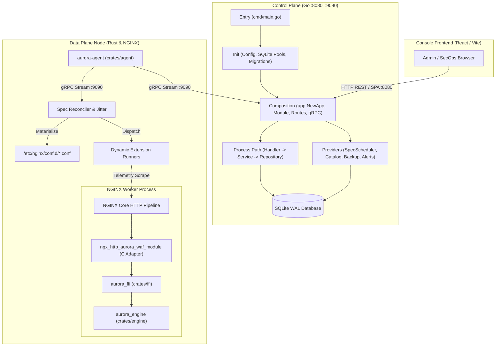
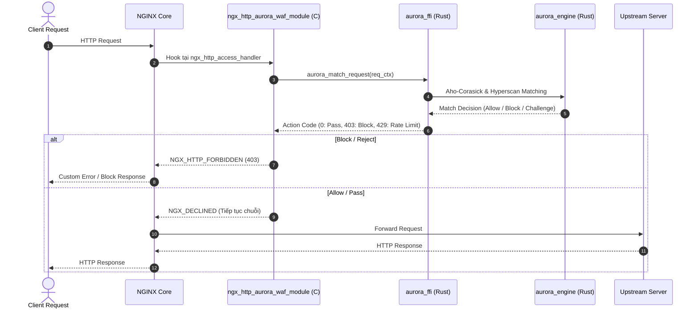

# Kiến Trúc Codebase Aurora API Gateway & WAF

Tài liệu này là **Single Source of Truth (SSOT)** về cấu trúc, tổ chức luồng thực thi, ranh giới thẩm quyền (authority boundaries) và ma trận ánh xạ **Object (Dữ liệu/Hợp đồng) $\leftrightarrow$ Behavior (Hành vi/Nhiệm vụ)** xuyên suốt toàn bộ hệ thống.

---

## 1. Bản Đồ Tổng Thể Hệ Thống (System Topology)

Hệ thống hoạt động theo mô hình **Hybrid Declarative Architecture**: Toàn bộ trạng thái cluster được quản lý tập trung tại Control Plane dưới dạng Spec snapshot, sau đó được phát tán tự động qua gRPC stream tới các Data Plane nodes.



---

## 2. Control Plane: Vòng Đời & Luồng Xử Lý (Lifecycle Path)

Hệ thống Go backend tuân thủ nghiêm ngặt nguyên tắc **Workflow Isolation** và **Flat Workflow Context** theo [`AGENTS.md`](file:///home/phucle/Desktop/aurora-waf/AGENTS.md):

```
Entry (main.go) 
  ↳ Init (Config -> SQLite Pools -> Migrations) 
      ↳ Composition (app.NewApp -> Module -> HTTP Router -> gRPC Server) 
          ↳ Execution (Handler -> Service -> Repository -> Database)
```

### 2.1. Chi tiết 4 Pha Vòng Đời

| Pha | Tệp Nguồn / Vị Trí | Nhiệm Vụ & Ranh Giới (Responsibilities & Invariants) |
| :--- | :--- | :--- |
| **1. Entry** | [`control-plane/cmd/main.go`](file:///home/phucle/Desktop/aurora-waf/control-plane/cmd/main.go) | Đọc flags CLI, lắng nghe OS signal (`SIGINT`, `SIGTERM`), khởi tạo vòng đời graceful shutdown context. |
| **2. Init** | [`internal/config/config.go`](file:///home/phucle/Desktop/aurora-waf/control-plane/internal/config/config.go)<br>[`infra/sqlite.go`](file:///home/phucle/Desktop/aurora-waf/control-plane/infra/sqlite.go)<br>[`infra/migrate.go`](file:///home/phucle/Desktop/aurora-waf/control-plane/infra/migrate.go) | - Phân giải biến môi trường `AURORA_*` vào struct `Config`.<br>- Khởi tạo kết nối SQLite với tách biệt rõ ràng: 1 Connection Pool Writer độc quyền (WAL lock) + Connection Pool Readers đồng thời.<br>- Chạy migration tự động từ `migrations/*.sql` (`0001_tables` -> `0002_indexes` -> `0003_triggers` -> `0004_seeds`). |
| **3. Composition** | [`internal/app/app.go`](file:///home/phucle/Desktop/aurora-waf/control-plane/internal/app/app.go)<br>[`internal/app/module.go`](file:///home/phucle/Desktop/aurora-waf/control-plane/internal/app/module.go)<br>[`internal/app/route.go`](file:///home/phucle/Desktop/aurora-waf/control-plane/internal/app/route.go)<br>[`internal/transport/grpc/server.go`](file:///home/phucle/Desktop/aurora-waf/control-plane/internal/transport/grpc/server.go) | - Khởi tạo `Module`: wire toàn bộ Repositories $\to$ Services $\to$ Handlers.<br>- Khởi chạy các Background Providers (`SpecScheduler`, `BackupScheduler`, `NotificationWorker`).<br>- Đăng ký HTTP Middleware (Auth, CORS, Security Headers, SPA fallback) & endpoints.<br>- Khởi tạo gRPC Server trên cổng `:9090` phục vụ Data Plane spec stream. |
| **4. Process Path** | `internal/transport/http/handler/`<br>`internal/service/`<br>`internal/repository/` | Thực thi nghiệp vụ theo mô hình phân tầng đơn hướng: **Handler (Transport/DTO) $\rightarrow$ Service (Logic/Invariants) $\rightarrow$ Repository (CTE-first SQL Query)**. |

---

### 2.2. Ma Trận Process Path: Object $\leftrightarrow$ Behavior (Control Plane)

Mỗi workflow được cô lập hoàn toàn: không tái sử dụng DTO giữa các workflow khác nhau, repository ưu tiên Common Table Expressions (CTE).

| Phân Vùng Nghiệp Vụ | Domain Object / Entity | File Thực Thi | Behavior / Function Chính | Ranh Giới & Durable State |
| :--- | :--- | :--- | :--- | :--- |
| **Spec & Cluster State** | `ClusterSpecRecord`<br>`ClusterSpecSnapshot`<br>`SpecReleaseCommand` | [`spec_handler.go`](file:///home/phucle/Desktop/aurora-waf/control-plane/internal/transport/http/handler/spec_handler.go)<br>[`spec_service.go`](file:///home/phucle/Desktop/aurora-waf/control-plane/internal/service/spec_service.go)<br>[`spec_repo.go`](file:///home/phucle/Desktop/aurora-waf/control-plane/internal/repository/spec_repo.go) | - `GetHeadSpec()`: Lấy YAML spec đang kích hoạt.<br>- `GenerateSpecSnapshot()`: Biên dịch toàn bộ trạng thái DB thành 1 file YAML duy nhất.<br>- `PublishRelease()`: Tính SHA-256 digest và lưu bất biến vào ledger. | Bảng `cluster_spec_releases` (bất biến qua triggers) & `cluster_spec_head` (singleton pointer). |
| **gRPC Node Spec Stream** | `WatchSpecRequest`<br>`SpecReleaseChunk`<br>`NodeHeartbeat` | [`spec_stream_handler.go`](file:///home/phucle/Desktop/aurora-waf/control-plane/internal/transport/grpc/handler/spec_stream_handler.go) | - `WatchSpec()`: Stream gRPC Server đẩy spec mới xuống nodes.<br>- `Heartbeat()`: Tiếp nhận nhịp tim, phiên bản và telemetry từ agent. | Bảng `cluster_nodes` (cập nhật `last_heartbeat`, `observed_release_id`). |
| **Extensions Catalog** | `ExtensionItem`<br>`ExtensionConfigUpdate`<br>`ExtensionRule` | [`extension_handler.go`](file:///home/phucle/Desktop/aurora-waf/control-plane/internal/transport/http/handler/extension_handler.go)<br>[`extension_service.go`](file:///home/phucle/Desktop/aurora-waf/control-plane/internal/service/extension_service.go)<br>[`extension_repo.go`](file:///home/phucle/Desktop/aurora-waf/control-plane/internal/repository/extension_repo.go) | - `ListExtensions()`: Lấy danh mục 115+ plugins.<br>- `UpdateConfig()`: Cập nhật JSON cấu hình / rules của extension.<br>- `ToggleStatus()`: Kích hoạt / Tắt tức thì plugin. | Bảng `extensions`. Tự động kích hoạt `SpecScheduler` tạo bản phát hành mới. |
| **Domains & TLS** | `DomainRecord`<br>`CreateDomainCommand`<br>`UpdateDomainCommand` | [`domains.go`](file:///home/phucle/Desktop/aurora-waf/control-plane/internal/transport/http/handler/domains.go)<br>[`domain_service.go`](file:///home/phucle/Desktop/aurora-waf/control-plane/internal/service/domain_service.go)<br>[`domain_repo.go`](file:///home/phucle/Desktop/aurora-waf/control-plane/internal/repository/domain_repo.go) | - `ListDomains()`, `CreateDomain()`<br>- `UpdateDomain()`, `DeleteDomain()`<br>- `ValidateDomainBinding()`: Đảm bảo upstream liên kết tồn tại hợp lệ. | Bảng `domains`. Ràng buộc khóa duy nhất trên tên miền (`UNIQUE(domain)`). |
| **Upstreams & Load Balancing** | `UpstreamRecord`<br>`UpstreamServer`<br>`HealthCheckConfig` | [`upstreams.go`](file:///home/phucle/Desktop/aurora-waf/control-plane/internal/transport/http/handler/upstreams.go)<br>[`upstream_service.go`](file:///home/phucle/Desktop/aurora-waf/control-plane/internal/service/upstream_service.go)<br>[`upstream_repo.go`](file:///home/phucle/Desktop/aurora-waf/control-plane/internal/repository/upstream_repo.go) | - `CreateUpstream()`, `UpdateUpstream()`<br>- `CompileUpstreamTopology()`: Tính toán hash thuật toán load balance (round-robin, ip_hash, least_conn). | Bảng `upstreams`, `upstream_releases`, `upstream_node_sync`. |
| **WAF Rules Core** | `RuleItem`<br>`RuleRevision`<br>`CreateRuleCommand` | [`rules.go`](file:///home/phucle/Desktop/aurora-waf/control-plane/internal/transport/http/handler/rules.go)<br>[`rules_service.go`](file:///home/phucle/Desktop/aurora-waf/control-plane/internal/service/rules_service.go)<br>[`rule_repo.go`](file:///home/phucle/Desktop/aurora-waf/control-plane/internal/repository/rule_repo.go) | - `CreateRule()`, `UpdateRule()`: Tạo bản ghi và lưu vết revision bất biến.<br>- `CompileRuleset()`: Gọi binary `aurora-compile` sinh snapshot engine. | Bảng `rules`, `rule_revisions`, `ruleset_releases`, `rule_definitions`. |
| **Access Control (IP/CIDR)** | `AccessObject`<br>`AccessRevision`<br>`AccessRelease` | [`access.go`](file:///home/phucle/Desktop/aurora-waf/control-plane/internal/transport/http/handler/access.go)<br>[`access_service.go`](file:///home/phucle/Desktop/aurora-waf/control-plane/internal/service/access_service.go)<br>[`access_repo.go`](file:///home/phucle/Desktop/aurora-waf/control-plane/internal/repository/access_repo.go) | - `ApplyChanges()`: Thêm/sửa/xóa quy tắc CIDR/ASN.<br>- `Desired()`: Cung cấp access snapshot cho node qua API.<br>- `Match()`: Ghi nhận sự kiện chặn IP vi phạm. | Bảng `access_objects`, `access_revisions`, `access_releases`, `access_reports`, `access_events`. |
| **Cluster Nodes** | `ClusterNodeRecord`<br>`NodeHeartbeatPayload`<br>`NodeDirective` | [`nodes.go`](file:///home/phucle/Desktop/aurora-waf/control-plane/internal/transport/http/handler/nodes.go)<br>[`nodes_service.go`](file:///home/phucle/Desktop/aurora-waf/control-plane/internal/service/nodes_service.go)<br>[`nodes_repo.go`](file:///home/phucle/Desktop/aurora-waf/control-plane/internal/repository/nodes_repo.go) | - `RegisterNode()`: Tự động ghi nhận node mới qua heartbeat.<br>- `TriggerReload()`: Phát chỉ thị reload NGINX rolling queue.<br>- `DrainNode()`: Cách ly node khỏi traffic. | Bảng `cluster_nodes`, `node_sync_logs`. |
| **Analytics Explorer** | `AnalyticsQuery`<br>`MetricSeries`<br>`TimeSeriesPoint` | [`analytics.go`](file:///home/phucle/Desktop/aurora-waf/control-plane/internal/transport/http/handler/analytics.go)<br>[`analytics_service.go`](file:///home/phucle/Desktop/aurora-waf/control-plane/internal/service/analytics_service.go)<br>[`analytics_repo.go`](file:///home/phucle/Desktop/aurora-waf/control-plane/internal/repository/analytics_repo.go) | - `QueryMetrics()`: Phân giải metric linh hoạt (tự động chuyển hướng giữa DB SQLite rollup cục bộ và Prometheus HTTP API).<br>- `IngestNodeMetrics()`: Thu thập CPU/RAM/RPS. | Bảng `node_metrics_history` kết hợp backend Prometheus linh hoạt. |
| **Security & Auth** | `UserRecord`<br>`AuthProviderItem`<br>`LoginCommand` | [`auth.go`](file:///home/phucle/Desktop/aurora-waf/control-plane/internal/transport/http/handler/auth.go)<br>[`security.go`](file:///home/phucle/Desktop/aurora-waf/control-plane/internal/transport/http/handler/security.go)<br>[`auth_repo.go`](file:///home/phucle/Desktop/aurora-waf/control-plane/internal/repository/auth_repo.go) | - `Login()`: Xác thực tài khoản với mật khẩu Argon2id + TOTP 2FA.<br>- `UpdateAuthProvider()`: Bật/tắt OIDC, LDAP, SAML. | Bảng `users`, `auth_providers`, `system_settings`. |
| **Notifications & Alerts** | `NotificationChannel`<br>`NotificationRule`<br>`AlertMessage` | [`notification.go`](file:///home/phucle/Desktop/aurora-waf/control-plane/internal/transport/http/handler/notification.go)<br>[`notification_service.go`](file:///home/phucle/Desktop/aurora-waf/control-plane/internal/service/notification_service.go)<br>[`notification_repo.go`](file:///home/phucle/Desktop/aurora-waf/control-plane/internal/repository/notification_repo.go) | - `SendAlert()`: Đẩy cảnh báo vào worker queue không nghẽn.<br>- `TestChannel()`: Kiểm tra kết nối webhook/Slack/Telegram/Email. | Bảng `notification_channels`, `notification_rules`. |
| **Backup & Disaster Recovery**| `BackupSettings`<br>`BackupHistoryRecord`<br>`BackupArchive` | [`backup.go`](file:///home/phucle/Desktop/aurora-waf/control-plane/internal/transport/http/handler/backup.go)<br>[`backup_service.go`](file:///home/phucle/Desktop/aurora-waf/control-plane/internal/service/backup_service.go)<br>[`backup_repo.go`](file:///home/phucle/Desktop/aurora-waf/control-plane/internal/repository/backup_repo.go) | - `CreateBackup()`: Sao lưu tức thời DB SQLite & cấu hình.<br>- `UploadToS3()`: Đẩy archive sang kho lưu trữ S3/MinIO.<br>- `RestoreBackup()`: Khôi phục trạng thái hệ thống. | Bảng `backup_settings`, `backup_history`. |

---

### 2.3. Ma Trận Providers & Background Workers (`internal/provider/`)

| Provider Worker | Struct Quản Lý | Chu Kỳ / Kích Hoạt | Behavior / Nhiệm Vụ Cốt Lõi |
| :--- | :--- | :--- | :--- |
| **SpecScheduler** | `SpecScheduler` | - Định kỳ (10s)<br>- Hoặc trigger ngay lập tức qua channel khi có mutation | Đọc snapshot từ DB, biên dịch file YAML spec hợp nhất, băm SHA-256 digest; nếu phát hiện thay đổi thì tạo release mới và notify gRPC stream phát cho các node. |
| **CatalogProvider** | `CatalogProvider` | Khởi động hệ thống | Nạp danh mục 115+ extensions chuẩn hóa, validate schema cấu hình mặc định vào bộ nhớ và DB. |
| **AnalyticsProvider** | `AnalyticsProvider` | Khi có truy vấn metrics | Quyết định nguồn cung cấp số liệu telemetry: chế độ `standalone` (SQLite history) hoặc `prometheus` (truy vấn reverse proxy Prometheus server). |
| **BackupScheduler** | `BackupScheduler` | Cron expression (VD: `0 2 * * *`) | Tự động chụp snapshot SQLite an toàn trong chế độ Online Backup và đẩy lên cloud storage theo retention days. |
| **NotificationWorker** | `NotificationWorker` | Bất đồng bộ (Channel queue 256) | Lấy alert events từ buffer, format tin nhắn theo template kênh (Telegram, Slack, Webhook, Discord) và retry gửi khi mạng lỗi. |

---

## 3. Rust Dataplane Agent (`crates/agent/`)

Agent là daemon Rust chạy trực tiếp trên mỗi Edge Node, chịu trách nhiệm kết nối với Controller qua gRPC, hiện thực hóa cấu hình thành file NGINX tĩnh, kiểm tra reload và điều phối telemetry.

### 3.1. Pipeline Vòng Đời Agent

```
Bootstrap (main.rs / app.rs)
  ↳ gRPC Sync Setup (sync/spec.rs, sync/heartbeat.rs)
      ↳ Spec Watcher (Bi-directional Protobuf Stream :9090)
          ↳ Digest Check -> Jitter Reconciliation (Chống thundering herd)
              ↳ Materialization (spec/materialize.rs -> active-upstreams.conf, active-routing.conf)
                  ↳ NGINX Hot Reload (-t -> -s reload)
                      ↳ Extension Dispatcher (Kích hoạt/tắt dynamically runners)
```

### 3.2. Ma Trận Phân Vùng Agent: Object $\leftrightarrow$ Behavior

| Phân Vùng | Object / Struct | File Thực Thi | Behavior / Logic Chi Tiết |
| :--- | :--- | :--- | :--- |
| **Bootstrap & App Context** | `App`<br>`AgentConfig` | [`src/app.rs`](file:///home/phucle/Desktop/aurora-waf/crates/agent/src/app.rs)<br>[`src/config.rs`](file:///home/phucle/Desktop/aurora-waf/crates/agent/src/config.rs) | - `App::init()`: Khởi tạo thư mục policy, tạo upstreams conf mặc định.<br>- `App::run()`: Spawn các background tokio tasks cho sync, heartbeat và dispatcher.<br>- Phân giải flags `--controller-url`, `--node-id`, `--auth-token`. |
| **gRPC Transport** | `GrpcClient` | [`src/grpc.rs`](file:///home/phucle/Desktop/aurora-waf/crates/agent/src/grpc.rs) | - Quản lý kênh kết nối HTTP/2 gRPC tới Controller.<br>- Chèn header xác thực `Authorization: Bearer <token>` vào metadata. |
| **Spec Reconciler** | `SpecSyncWorker`<br>`Spec` (Schema AST) | [`src/sync/spec.rs`](file:///home/phucle/Desktop/aurora-waf/crates/agent/src/sync/spec.rs)<br>[`src/spec/schema.rs`](file:///home/phucle/Desktop/aurora-waf/crates/agent/src/spec/schema.rs) | - `sync_loop()`: Mở kết nối stream nhận chunk spec.<br>- `compute_sha256()`: Kiểm tra digest với release hiện tại.<br>- Áp dụng **Jitter Delay ngẫu nhiên** (0 - 2.5s) trước khi reload để tránh sập upstream đồng loạt. |
| **Materializer** | `NginxManager`<br>`MaterializeResult` | [`src/spec/materialize.rs`](file:///home/phucle/Desktop/aurora-waf/crates/agent/src/spec/materialize.rs)<br>[`src/nginx.rs`](file:///home/phucle/Desktop/aurora-waf/crates/agent/src/nginx.rs) | - `materialize_nginx()`: Trích xuất config upstreams và routes từ YAML Spec ra đĩa cứng.<br>- `NginxManager::test_config()`: Chạy `nginx -t`.<br>- `NginxManager::reload()`: Chạy `nginx -s reload` an toàn không rớt kết nối. |
| **Node Heartbeat** | `HeartbeatWorker`<br>`HeartbeatPayload` | [`src/sync/heartbeat.rs`](file:///home/phucle/Desktop/aurora-waf/crates/agent/src/sync/heartbeat.rs) | - Định kỳ (mỗi 10s) gửi telemetry node: CPU, RAM, active connections, status sang Controller.<br>- Tiếp nhận chỉ thị cưỡng chế reload từ Controller. |
| **Extension Dispatcher** | `ExtensionDispatcher`<br>`ExtensionRunners` | [`src/extension/dispatcher.rs`](file:///home/phucle/Desktop/aurora-waf/crates/agent/src/extension/dispatcher.rs) | - `apply_spec()`: Phân tích khối `extensions:` trong Spec.<br>- Bật/tắt động các task chạy nền của bot detection, distributed rate limiter mà không cần khởi động lại Agent. |
| **Telemetry Pipeline** | `MetricsManager`<br>`PrometheusExporter`<br>`OtlpExporter` | [`src/extension/metrics/`](file:///home/phucle/Desktop/aurora-waf/crates/agent/src/extension/metrics/) | - Cào chỉ số NGINX stub status.<br>- `PrometheusPullExporter`: Phục vụ endpoint `:9145/metrics`.<br>- `OtlpPushExporter`: Đẩy traces/metrics sang collector OTLP gRPC. |

---

## 4. Rust WAF Engine & NGINX FFI (`crates/engine/`, `crates/ffi/`, `adapters/nginx/`)

Tầng xử lý lưu lượng thực (Data Plane Core) chịu trách nhiệm kiểm tra từng gói tin HTTP với độ trễ micro-giây (sub-millisecond).



### 4.1. Ma Trận Engine & FFI Components

| Thành Phần | Object / Biểu Tượng | File Thực Thi | Nhiệm Vụ & Thuật Toán |
| :--- | :--- | :--- | :--- |
| **Engine Core** | `Engine`<br>`CompiledRuleset`<br>`AhoCorasickMatcher` | [`crates/engine/src/lib.rs`](file:///home/phucle/Desktop/aurora-waf/crates/engine/src/lib.rs)<br>[`crates/engine/src/rules.rs`](file:///home/phucle/Desktop/aurora-waf/crates/engine/src/rules.rs) | - Khởi tạo bộ so khớp đa chuỗi Aho-Corasick + Hyperscan vectorization.<br>- So khớp path, header, body parameters với quy tắc WAF (SQLi, XSS, RCE). |
| **Compiler Binary** | `aurora-compile` (Binary CLI) | [`crates/engine/src/bin/compile.rs`](file:///home/phucle/Desktop/aurora-waf/crates/engine/src/bin/compile.rs) | - Nhận ruleset JSON/YAML từ Controller.<br>- Biên dịch thành snapshot nhị phân bất biến (deterministic binary snapshot) tối ưu truy cập bộ nhớ cache CPU L1/L2. |
| **Access CIDR Engine** | `RadixTree`<br>`IpMatcher` | [`crates/engine/src/access.rs`](file:///home/phucle/Desktop/aurora-waf/crates/engine/src/access.rs) | - Lưu trữ dải IP CIDR và Geo ASN trong cây Radix Tree.<br>- Kiểm tra IP nguồn trong thời gian $O(1)$. |
| **Rust FFI Export** | `aurora_match_request`<br>`aurora_hot_swap_policy`<br>`aurora_free_result` | [`crates/ffi/src/lib.rs`](file:///home/phucle/Desktop/aurora-waf/crates/ffi/src/lib.rs) | - C ABI `extern "C"` an toàn (panic safety wrapper).<br>- Trao đổi dữ liệu pointer và buffer giữa C memory của NGINX và Rust memory an toàn. |
| **Telemetry Serialization** | `TelemetryClient`<br>`ProtobufEncoder` | [`crates/ffi/src/telemetry/`](file:///home/phucle/Desktop/aurora-waf/crates/ffi/src/telemetry/) | - Đóng gói các log vi phạm WAF vào Protobuf binary buffer không làm chậm NGINX worker. |
| **NGINX C Module Adapter** | `ngx_http_aurora_waf_module` | [`adapters/nginx/src/ngx_http_aurora_waf_module.c`](file:///home/phucle/Desktop/aurora-waf/adapters/nginx/src/ngx_http_aurora_waf_module.c) | - Đăng ký hook vào pha `NGX_HTTP_ACCESS_PHASE` của NGINX.<br>- Trích xuất request line, URI, headers, client IP.<br>- Nhận quyết định từ FFI và chặn/cho qua trực tiếp trong luồng event loop. |

---

## 5. Frontend Console (`ui/src/`)

Giao diện quản trị là Single Page Application (SPA) xây dựng bằng React 19, TypeScript, Tailwind CSS và Radix UI, được nhúng trực tiếp vào binary của Go Controller qua `//go:embed all:dist`.

### 5.1. Ma Trận UI Page, Components & API Contract

| Route / Màn Hình | Tệp Trang (Page) | Component Chính | Behavior & Tương Tác Người Dùng | API Endpoint Liên Kết |
| :--- | :--- | :--- | :--- | :--- |
| **Dashboard** (`/`) | [`pages/dashboard/page.tsx`](file:///home/phucle/Desktop/aurora-waf/ui/src/pages/dashboard/page.tsx) | `StatsGrid`, `TrafficChart`, `ActiveAlerts`, `QuickNodes` | - Tổng quan RPS, lưu lượng bị chặn, số lượng node active.<br>- Biểu đồ thời gian thực. | `GET /api/v1/analytics/timeline`<br>`GET /api/v1/nodes` |
| **Extensions Workspace** (`/extensions`) | [`pages/extensions/page.tsx`](file:///home/phucle/Desktop/aurora-waf/ui/src/pages/extensions/page.tsx) | [`ExtensionCard.tsx`](file:///home/phucle/Desktop/aurora-waf/ui/src/pages/extensions/components/ExtensionCard.tsx)<br>[`ExtensionTable.tsx`](file:///home/phucle/Desktop/aurora-waf/ui/src/pages/extensions/components/ExtensionTable.tsx)<br>[`ExtensionConfigModal.tsx`](file:///home/phucle/Desktop/aurora-waf/ui/src/pages/extensions/components/ExtensionConfigModal.tsx) | - Hiển thị 115+ plugins theo 11 nhóm chuyên biệt.<br>- **Click thẻ / hàng mở Bottom Drawer cao 78vh**.<br>- Xem bảng dữ liệu rules chuyên biệt từng extension.<br>- **Thêm quy tắc 2 Mode: UI View (Form trực quan) & JSON View (Raw editor)**. | `GET /api/v1/extensions`<br>`PUT /api/v1/extensions/:id/status`<br>`PUT /api/v1/extensions/:id/config` |
| **WAF Rules Engine** (`/rules`) | [`pages/rules/page.tsx`](file:///home/phucle/Desktop/aurora-waf/ui/src/pages/rules/page.tsx) | `RulesList`, `RuleDetailDrawer`, `RuleEditorModal` | - Danh sách quy tắc WAF phân nhóm (SQLi, XSS, Traversal, Bot).<br>- Chỉnh sửa độ ưu tiên, score, hành vi (Allow/Log/Block). | `GET /api/v1/rules`<br>`POST /api/v1/rules`<br>`PUT /api/v1/rules/:id` |
| **Domains & Certificates** (`/domains`) | [`pages/domains/page.tsx`](file:///home/phucle/Desktop/aurora-waf/ui/src/pages/domains/page.tsx) | `DomainList`, `DomainModal`, `CertStatusBadge` | - Cấu hình Host domain, TLS Auto-renew, Min TLS version, HSTS.<br>- Ràng buộc domain với Upstream cụ thể. | `GET /api/v1/domains`<br>`POST /api/v1/domains`<br>`PUT /api/v1/domains/:id` |
| **Upstreams Topology** (`/upstreams`) | [`pages/upstreams/page.tsx`](file:///home/phucle/Desktop/aurora-waf/ui/src/pages/upstreams/page.tsx) | `UpstreamCard`, `UpstreamForm`, `ServerStatusList` | - Khai báo danh sách server backend IP:Port, trọng số weight.<br>- Cấu hình thuật toán load balancing và Active Health Checks. | `GET /api/v1/upstreams`<br>`POST /api/v1/upstreams` |
| **Cluster Nodes** (`/nodes`) | [`pages/nodes/page.tsx`](file:///home/phucle/Desktop/aurora-waf/ui/src/pages/nodes/page.tsx) | `NodeTable`, `NodeMetricsCard`, `ReloadModal` | - Giám sát trạng thái Ready / Syncing / Drift của từng node.<br>- Phát lệnh Rolling Reload NGINX.<br>- Xem spec release digest node đang chạy. | `GET /api/v1/nodes`<br>`POST /api/v1/nodes/:id/reload` |
| **Access Control (IP)** (`/access`) | [`pages/access/page.tsx`](file:///home/phucle/Desktop/aurora-waf/ui/src/pages/access/page.tsx) | `IpTable`, `AddCidrModal`, `GeoBlockPanel` | - Quản lý Whitelist / Blacklist theo IP, subnet CIDR hoặc quốc gia.<br>- Xem số lần vi phạm và log sự kiện vi phạm gần nhất. | `GET /api/v1/access/catalog`<br>`POST /api/v1/access/changes` |
| **Analytics Explorer** (`/analytics`) | [`pages/analytics/page.tsx`](file:///home/phucle/Desktop/aurora-waf/ui/src/pages/analytics/page.tsx) | `ExplorerMetricsGrid`, `MetricBuilder`, `LatencyChart` | - Truy vấn metrics theo node, endpoint, status code.<br>- Phân tích p50, p90, p99 latency và lưu lượng throughput. | `POST /api/v1/analytics/query` |
| **Settings & DR** (`/settings`) | [`pages/settings/page.tsx`](file:///home/phucle/Desktop/aurora-waf/ui/src/pages/settings/page.tsx) | `SecurityTab`, `IntegrationsTab`, `BackupsTab`, `AuditTab` | - Cấu hình 2FA, người dùng, SSO.<br>- Chuyển đổi chế độ Telemetry (`standalone` $\leftrightarrow$ `prometheus`).<br>- Sao lưu snapshot & cấu hình đẩy lên S3. | `GET /api/v1/settings/*`<br>`GET /api/v1/backups`<br>`POST /api/v1/backups` |

---

## 6. Sơ Đồ Ánh Xạ Thư Mục Dự Án (Directory Layout Mapping)

```
aurora-waf/
├── control-plane/                # Go Control Plane (REST API, gRPC Server, Spec Engine)
│   ├── cmd/                      # Điểm vào ứng dụng (main.go)
│   ├── infra/                    # SQLite pools, Migrations engine
│   ├── internal/
│   │   ├── app/                  # Composition root: Module wiring, routes, App lifecycle
│   │   ├── config/               # Cấu hình môi trường AURORA_*
│   │   ├── console/              # Nhúng giao diện Web dist/ vào binary Go (//go:embed)
│   │   ├── domain/               # Domain entities, value objects, error taxonomy
│   │   ├── provider/             # Background workers (SpecScheduler, Catalog, Backup)
│   │   ├── repository/           # CTE-first SQL queries truy cập SQLite
│   │   ├── service/              # Nghiệp vụ logic & validation boundaries
│   │   └── transport/            # HTTP Handlers (Gin) & gRPC Handlers (Protobuf)
│   └── migrations/               # SQLite Schema (0001_tables, 0002_indexes, 0003_triggers, 0004_seeds)
│
├── crates/
│   ├── agent/                    # Rust Edge Node Daemon (gRPC consumer, Spec materializer)
│   │   └── src/
│   │       ├── config.rs         # Tham số CLI agent (--controller-url, --node-id)
│   │       ├── extension/        # Dispatcher & Telemetry exporters (Prometheus, OTLP)
│   │       ├── grpc.rs           # gRPC client kết nối tới Controller
│   │       ├── nginx.rs          # Quản lý process NGINX (test, reload)
│   │       ├── spec/             # Schema parsing, Materialization thành file .conf
│   │       └── sync/             # Bi-directional gRPC spec stream & heartbeat workers
│   ├── engine/                   # Rust WAF Core Engine (Aho-Corasick, Hyperscan, Rule Compiler)
│   └── ffi/                      # Rust C ABI Bindings & Protobuf Telemetry Serialization
│
├── adapters/
│   └── nginx/                    # C Dynamic Module ngx_http_aurora_waf_module.so
│       ├── include/              # Header định nghĩa C ABI
│       └── src/                  # NGINX phase hooks & shared memory zone
│
├── ui/                           # Single Page Application (React 19, TypeScript, Vite)
│   ├── src/
│   │   ├── components/           # UI elements tái sử dụng (Button, Table, Drawer, Badges)
│   │   ├── lib/api/              # Typed HTTP clients gọi Controller REST APIs
│   │   └── pages/                # Các module màn hình (Dashboard, Extensions, Rules, Nodes...)
│   └── vite.config.js            # Cấu hình build xuất thẳng vào control-plane/internal/console/dist
│
├── deploy/                       # Docker & Production Assets
│   └── docker/                   # Dockerfile.controller, Dockerfile.node, entrypoint scripts
├── docker-compose.yml            # Khởi chạy cụm Controller + Node-01 cục bộ
├── AGENTS.md                     # Nguyên tắc phát triển (Workflow-first, Flat Entity, No God Context)
├── CODEBASE.md                   # Single Source of Truth về cấu trúc Codebase (tài liệu này)
└── README.md                     # Giới thiệu kiến trúc, tính năng & hướng dẫn vận hành nhanh
```

---

## 7. Nguyên Tắc Mở Rộng Codebase (Extension Invariants)

Khi bổ sung hoặc chỉnh sửa bất kỳ module nào, luôn tuân thủ các quy tắc bất biến:
1. **Một Workflow $\rightarrow$ Một Luồng Khép Kín**: Không dùng chung DTO hoặc Entity giữa các workflow khác nhau; mỗi workflow sở hữu Command, Result, Service method và Repository method riêng.
2. **CTE-First SQL**: Repository luôn ưu tiên Common Table Expressions trong 1 câu truy vấn duy nhất để đảm bảo tính nguyên tử (atomic) và truy vết được.
3. **Immutability Releases**: Bảng release ledger (`cluster_spec_releases`, `ruleset_releases`, `policy_cluster_releases`) là bất biến sau khi ghi (được bảo vệ bởi Database Triggers).
4. **Không Thundering Herd**: Mọi thay đổi cấu hình nạp xuống Data Plane phải đi qua kiểm tra Digest SHA-256 và Jitter delay trước khi reload NGINX.
