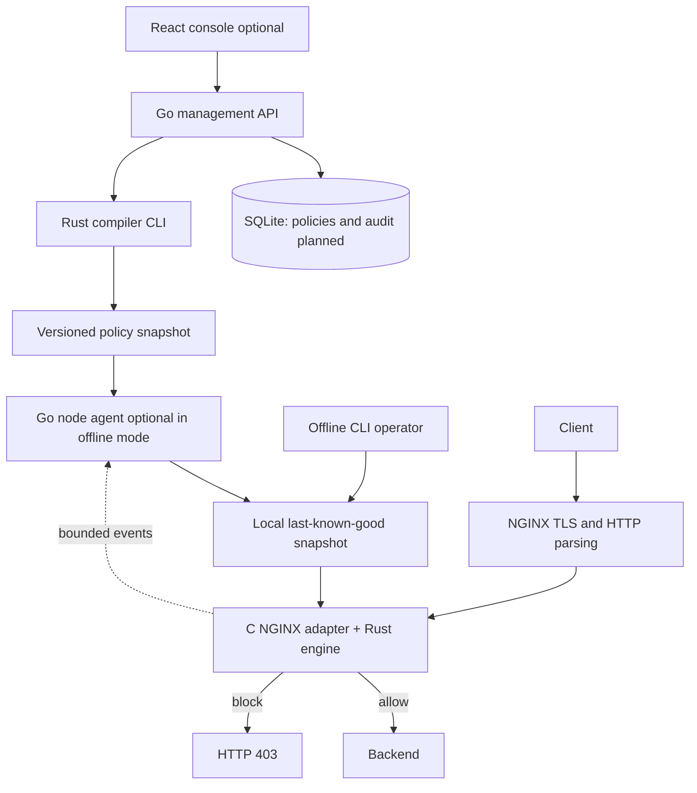

# Kiến trúc đích

Tài liệu này mô tả thiết kế dự kiến; trạng thái implementation xem README/roadmap.

Hiện đã có [runtime bootstrap](RUNTIME.md): React embed trong Go; C/Rust NGINX module
inspect exact path, offline JSON policy và graceful reload. Full compiler/controller
distribution trong sơ đồ dưới chưa triển khai. Go console không nằm trong data plane.

## Trách nhiệm

| Thành phần | Sở hữu | Không phụ thuộc lúc evaluate |
| --- | --- | --- |
| React | Editor, trạng thái publish, event explorer | NGINX request lifecycle |
| Go controller | Auth, revision, storage, rollout, audit | Traffic request |
| Rust compiler CLI | Parse/validate rule, sinh IR và diagnostics | UI |
| Go node agent | Pull/verify/stage snapshot, reload, collect events | UI |
| C adapter | NGINX config, phases, buffers, cleanup, status mapping | Management API |
| Rust engine | Canonicalization, matching, scoring, policy state | Network/DB/compiler |

## Luồng request

Go áp dụng `internal/{app,config,domain,repository,service,transport,test}` theo
[ADR 0004](adr/0004-go-layout-sqlite.md). SQLite là persistence cho single-controller
MVP; hiện đã có connection/bootstrap ledger, bảng nghiệp vụ bổ sung ở Stage 3.
Database ở control plane, không tham gia request evaluation của NGINX.

NGINX parse HTTP → xác định virtual host/policy → chuẩn bị context → inspect
headers/query → nếu policy yêu cầu body, tiếp tục qua callback đọc body có giới
hạn → evaluate → enforce/log. Request giữ một policy generation xuyên các phase.
Internal redirect và subrequest phải có semantics rõ trước khi enable MVP.

Không network call, disk read hoặc regex compilation trên đường evaluate thông
thường. Body file cần chiến lược bounded I/O đã benchmark; MVP có thể từ chối theo
policy thay vì âm thầm bỏ inspection. Telemetry enqueue có giới hạn và không đợi collector.

## Lifecycle policy

Khởi tạo/validate trước khi worker dùng; immutable engine handle cho mỗi generation.
MVP dùng graceful NGINX reload sau khi stage snapshot và chạy `nginx -t`.
Worker cũ hoàn tất request với generation cũ; không yêu cầu tất cả worker đổi cùng
một thời điểm. Reload thất bại giữ generation đang chạy, node báo degraded.
Hot swap không reload chỉ xem xét sau khi MVP ổn định.

## Failure semantics

- UI/controller/agent mất kết nối: dùng snapshot đã active, báo stale.
- Snapshot mới invalid/incompatible: reject, giữ last-known-good và audit lỗi.
- Cold start enable WAF mà không có snapshot hợp lệ: từ chối config/start.
- Lỗi evaluate hoặc vượt giới hạn: xử lý bằng policy lỗi rõ ràng, có event;
  mặc định đề xuất reject và cần benchmark/tuning trước khi áp dụng production.
- Mode `off` là bypass có chủ đích; `detection_only` ghi decision dự kiến nhưng
  không chặn do detection. Lỗi hạ tầng có contract riêng, không trộn với score.

## Rate limit

Không gắn `RateLimit` vào threshold scoring như một tính năng đã có. Giai đoạn đầu
có thể vận hành NGINX native limiter độc lập. Limiter Aurora về sau cần shared
memory hoặc cơ chế đồng bộ giữa worker, bounded cardinality và chính sách eviction.
Counter trong Rust process riêng lẻ không tạo limit toàn node.
