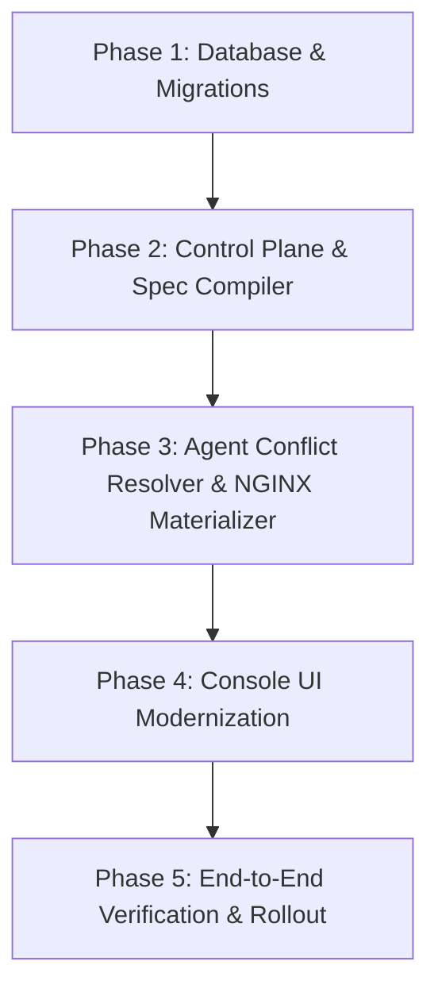

# Aurora Gateway: Routing & SSL/TLS Architecture Blueprint

Tài liệu thiết kế kiến trúc và phân rã nhiệm vụ (Work Breakdown Structure) cho việc chuyển đổi phân hệ **`Domains`** thành **`Routing`** (quan hệ 1-1 với Upstream) và phân hệ **`Certificates & mTLS`** (độc lập theo SNI), đồng thời trang bị bộ giải quyết xung đột logic (**Conflict Resolver**) trên Rust Agent Dataplane.

---

## 1. Mục tiêu & Nguyên tắc Thiết kế (Architecture Principles)

```
                       ┌─────────────────────────┐
                       │   Client Request (L4)   │
                       └────────────┬────────────┘
                                    │ TLS Handshake (SNI Match)
                                    ▼
                       ┌─────────────────────────┐
                       │ Certificates / SSL Store│ (SNI -> Cert/Key + mTLS CA)
                       └────────────┬────────────┘
                                    │ Decrypted HTTP (L7)
                                    ▼
                       ┌─────────────────────────┐
                       │  Routing Engine (1-1)   │ (Host + Path -> Upstream)
                       └────────────┬────────────┘
                                    │ Proxy Pass
                                    ▼
                       ┌─────────────────────────┐
                       │    Upstream Cluster     │ (Load balanced Backend Nodes)
                       └─────────────────────────┘
```

1. **Phân tầng mạng triệt để (Network Layer Decoupling):**
   * **Layer 4 / TLS Termination & mTLS:** Thuộc về **`Certificates`**, quản lý và đối soát tự động theo **`SNI` (Domain)**.
   * **Layer 7 / HTTP Application Routing:** Thuộc về **`Routing`**, nhận diện `Host` + `Path` $\rightarrow$ chuyển tiếp 1-1 tới đúng một **`Upstream`**.
2. **Flat Entity & Flat Workflow (Tuân thủ AGENTS.md):**
   * Mỗi bản ghi Route là một thực thể phẳng, độc lập, không lồng ghép nhiều nhánh cây phức tạp.
   * Quan hệ **1 Route $\rightarrow$ 1 Upstream duy nhất**.
3. **Agent Self-Healing & Conflict Resolution:**
   * Agent Dataplane chịu trách nhiệm gom nhóm Server blocks, khử trùng lặp Location, sắp xếp theo độ dài Path, và tự động tạo Fallback (503) khi Upstream chưa tồn tại để **tuyệt đối không làm sập NGINX**.

---

## 2. Phân rã Giai đoạn & Task chi tiết (Phase Breakdown)



---

### Phase 1: Database Authority & Migration (SoT)
> **Mục tiêu:** Nâng cấp cấu trúc SQLite lưu trữ độc lập cho `routes` và `ssl_certificates`.

* [ ] **Task 1.1: Tạo Migration 0006 (`0006_routing_and_certificates.sql`)**
  * Bảng `routes`:
    ```sql
    CREATE TABLE IF NOT EXISTS routes (
        id TEXT PRIMARY KEY,
        name TEXT NOT NULL,
        host TEXT NOT NULL,               -- e.g. "api.aurora.local" hoặc "*"
        path TEXT NOT NULL DEFAULT '/',   -- e.g. "/api/v1/auth"
        upstream_name TEXT NOT NULL,      -- Quan hệ 1-1 với Upstream
        enabled BOOLEAN NOT NULL DEFAULT 1,
        strip_path BOOLEAN NOT NULL DEFAULT 0,
        websocket BOOLEAN NOT NULL DEFAULT 0,
        priority INTEGER NOT NULL DEFAULT 0,
        description TEXT,
        created_at DATETIME DEFAULT CURRENT_TIMESTAMP,
        updated_at DATETIME DEFAULT CURRENT_TIMESTAMP
    );
    CREATE INDEX IF NOT EXISTS idx_routes_host ON routes(host);
    ```
  * Bảng `ssl_certificates`:
    ```sql
    CREATE TABLE IF NOT EXISTS ssl_certificates (
        id TEXT PRIMARY KEY,
        name TEXT NOT NULL,
        snis_json TEXT NOT NULL,          -- JSON array e.g. ["api.aurora.local", "*.aurora.local"]
        cert_pem TEXT NOT NULL,           -- Public certificate
        key_pem TEXT NOT NULL,            -- Private key
        mtls_enabled BOOLEAN NOT NULL DEFAULT 0,
        client_ca_pem TEXT,               -- CA để verify client cert
        verify_depth INTEGER DEFAULT 1,
        enabled BOOLEAN NOT NULL DEFAULT 1,
        created_at DATETIME DEFAULT CURRENT_TIMESTAMP,
        updated_at DATETIME DEFAULT CURRENT_TIMESTAMP
    );
    ```
* [x] **Task 1.1: Tạo Migration 0006 (`0006_routing_and_certificates.sql`)** (Đã hoàn thành)
* [x] **Task 1.2: Dữ liệu chuyển đổi (Data Migration)** (Đã hoàn thành)
* [x] **Task 1.3: Cập nhật `control-plane/internal/app/migration.go`** (Đã hoàn thành)

---

### Phase 2: Control Plane & Declarative Spec Compiler
> **Mục tiêu:** Thay thế hoàn toàn hai luồng `domain` và `domain_routing` cũ bằng hai module độc lập chuẩn mực: **`routing`** (Route CRUD, 1-1 Upstream, 7-Phase Plugins) và **`certificate`** (SNI & mTLS Store), đồng thời biên dịch thành `node-spec.yaml`.

* [x] **Task 2.1: Domain Entities & Repository Ports** (Đã hoàn thành)
  * Định nghĩa `Route` entity và `RouteRepository` interface (CRUD, flat projection, CTE-first).
  * Định nghĩa `Certificate` entity và `CertificateRepository` interface.
  * Xóa bỏ hoàn toàn mã legacy của `domain` và `domain_routing`.
* [x] **Task 2.2: REST API Transport Handlers** (Đã hoàn thành)
  * Routes API (`GET`, `POST`, `PUT`, `DELETE`, `PUT /:id/status` tại `/api/v1/routes`).
  * Certificates API (`GET`, `POST`, `PUT`, `DELETE` tại `/api/v1/certificates`).
  * Bảo vệ Upstream không bị xóa nếu đang được Route tham chiếu.
* [x] **Task 2.3: Nâng cấp Spec Compiler (`spec_repo.go` & `spec_scheduler.go`)** (Đã hoàn thành)
  * Nạp authority routing trực tiếp từ bảng `routes`.
  * Hỗ trợ dynamic path prefix routing.

---

### Phase 3: Rust Agent Dataplane & Conflict Resolution
> **Mục tiêu:** Agent parse spec, giải quyết toàn bộ xung đột cấu hình, xuất file NGINX hợp lệ và reload an toàn.

* [ ] **Task 3.1: Mở rộng Model Spec trong Rust (`crates/agent/src/spec/`)**
  * `crates/agent/src/spec/routing.rs`: Cập nhật `RouteEntry` và `RoutingSpec`.
  * `crates/agent/src/spec/certificate.rs` (Mới): Định nghĩa `CertificateSpec` và `MtlsSpec`.
* [ ] **Task 3.2: Xây dựng bộ giải quyết xung đột (`Conflict Resolver`)**
  * `Server Block Consolidation`: Gom tất cả các Route có cùng `host` vào 1 khối `server { ... }`.
  * `Location Collision Resolution`:
    * Nếu trùng `(host, path)`, chọn rule có độ ưu tiên cao hơn hoặc ID mới hơn; ghi log `warn!` loại bỏ rule trùng.
    * Sắp xếp danh sách `location` theo độ dài Path giảm dần (longest prefix first).
  * `Dangling Upstream Protection`:
    * Kiểm tra `spec.upstreams.contains(route.upstream)`.
    * Nếu Upstream không tồn tại $\rightarrow$ Thay thế bằng khối fallback trả về `503 Service Unavailable` JSON, ngăn chặn NGINX báo lỗi `host not found`.
  * `SNI Certificate Matching`:
    * Tìm kiếm chứng chỉ khớp với `server_name` (hỗ trợ cả exact match và wildcard match `*.domain.com`).
    * Nếu có chứng chỉ khớp $\rightarrow$ Ghi file cert/key ra đĩa (`/var/lib/aurora-routing/certs/`) và bật `listen 443 ssl`.
    * Nếu có `client_ca` $\rightarrow$ Render `ssl_client_certificate` và `ssl_verify_client on;`.
* [ ] **Task 3.3: Materialize NGINX Config & Hot Reload**
  * Xuất ra `active-domain-routing.conf`.
  * Chạy `nginx -t` kiểm tra cú pháp; nếu hợp lệ thì `nginx -s reload`.

---

### Phase 4: UI & Console Experience (`ui/src/`)
> **Mục tiêu:** Xây dựng giao diện quản lý Routing và Certificates hiện đại, trực quan, tốc độ cao.

* [ ] **Task 4.1: Tái cấu trúc Menu Sidebar**
  * Đổi `Domains` $\rightarrow$ `Routing` (Icon: `Network` hoặc `Route`).
  * Bổ sung mục `Certificates` (Icon: `ShieldCheck`).
* [ ] **Task 4.2: Xây dựng trang Quản lý Routing (`ui/src/pages/routing/`)**
  * **Routing Table:** Hiển thị `Status`, `Host / Domain`, `Path`, `Bound Upstream`, `SSL Indicator`, `Actions`.
  * **Add/Edit Route Modal:**
    * Inbound: Host (`api.example.com`), Path (`/api/v1/*`), Priority.
    * Target: Dropdown chọn Upstream có sẵn (hiển thị trạng thái active nodes).
    * Advanced: Bật/tắt Websocket, Strip Path.
* [ ] **Task 4.3: Xây dựng trang Quản lý Certificates (`ui/src/pages/certificates/`)**
  * **Certificates List:** Danh sách chứng chỉ, ngày hết hạn (Expiry tracking với badge cảnh báo sắp hết hạn), danh sách SNI domains được bảo vệ, trạng thái mTLS.
  * **Upload/Edit Certificate Modal:**
    * Nhập danh sách SNI domains (hỗ trợ tag list).
    * Upload/Paste Public Certificate & Private Key.
    * Toggle mTLS: Upload Client CA Certificate và cấu hình Verify Depth.

---

### Phase 5: Verification & E2E Testing
> **Mục tiêu:** Kiểm thử toàn diện luồng dữ liệu từ UI đến NGINX traffic thật.

* [ ] **Task 5.1: Test Khả năng giải quyết xung đột (Agent Unit & Integration Tests)**
  * Test 2 route cùng host khác path $\rightarrow$ gom thành 1 server.
  * Test 2 route trùng host và trùng path $\rightarrow$ giữ 1 route, không lỗi cú pháp.
  * Test route trỏ vào Upstream ảo $\rightarrow$ NGINX vẫn reload thành công, request trả về 503 fallback.
* [ ] **Task 5.2: Test Live Traffic (cURL)**
  * Kiểm tra request HTTP qua port 80 đúng path $\rightarrow$ trỏ đúng Upstream.
  * Kiểm tra TLS Handshake qua SNI và mTLS từ chối khi client không có cert hợp lệ.
* [ ] **Task 5.3: Dọn dẹp code cũ (Clean up Legacy `domains` references)**
  * Xóa bỏ các file giao diện và code thừa không còn sử dụng.
