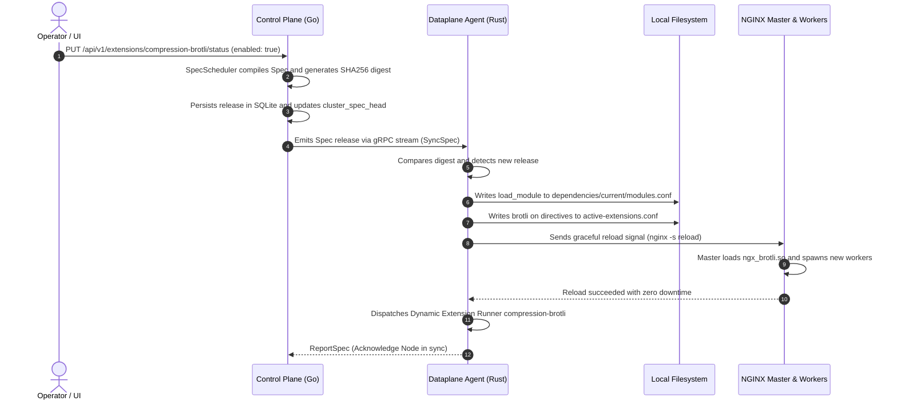
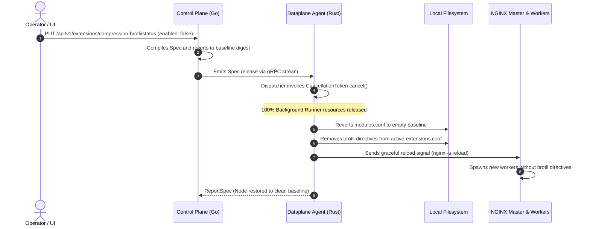

# Aurora API Gateway & WAF: Comprehensive Spec Synchronization Architecture

This document provides a technical specification of the configuration synchronization architecture (**Spec Sync**) connecting the **Control Plane (Go)**, **Dataplane Agent (Rust)**, and the **Data-path Engine (NGINX/C)**.

---

## 1. Core Architecture Principles

1. **Unified Declarative State: `Spec`**:
   - The entire system configuration—including virtual hosts, routing trees, upstream clusters, SSL certificates, WAF mitigation rules, IP access control lists, and all 115 modular extensions—is modeled as a single declarative data structure named `Spec`.
   - Fragmented entity taxonomies such as `NodeSpec`, `RuleSpec`, or `RoutingSpec` are strictly eliminated in favor of a single unified model.
2. **Digest-Driven Delta Evaluation**:
   - Every published `Spec` release is cryptographically identified by a deterministic SHA-256 digest calculated over its normalized YAML payload.
   - Nodes evaluate incoming releases against their local runtime hash in memory and bypass disk writes or process reloads if the digest is identical.
3. **Zero-Downtime Reload via Worker Connection Draining**:
   - NGINX data-path updates are applied via graceful master reloads (`SIGHUP` / `nginx -s reload`). Existing worker processes transition to a draining state, completing active in-flight HTTP/TCP connections before terminating, while newly spawned workers immediately serve subsequent traffic using the latest configuration.
4. **Zero-Overhead Extension Lifecycle**:
   - **C Layer (NGINX Dynamic Modules)**: Native shared object modules (`.so`, such as Brotli or GeoIP) are only loaded (`load_module`) when explicitly enabled (`enabled: true`). When disabled, `modules.conf` contains no loading directives, eliminating unnecessary memory consumption and execution overhead.
   - **Rust Layer (In-Process Agent)**: All 115 extensions are tracked via cooperative `CancellationToken` instances. When an extension is disabled, its background runner is canceled immediately, freeing memory and CPU cycles.

---

## 2. Layered Architecture

```
┌────────────────────────────────────────────────────────────────────────┐
│                        CONTROL PLANE (Go Service)                      │
│  ┌───────────────────────┐  ┌──────────────────────────────────────┐   │
│  │ SpecScheduler (Cron)  │  │ REST APIs (/api/v1/extensions, ...)  │   │
│  └──────────┬────────────┘  └──────────────────┬───────────────────┘   │
│             │                                  │                       │
│             ▼                                  ▼                       │
│  ┌─────────────────────────────────────────────────────────────────┐   │
│  │ Spec Sync Repository & SQLite Storage (WAL Mode)                │   │
│  │ - cluster_spec_releases (Immutable History, UNIQUE Digest)      │   │
│  │ - cluster_spec_head     (Singleton Head Pointer)                │   │
│  └─────────────────────────────────┬───────────────────────────────┘   │
│                                    │ gRPC Server Stream (:9090)        │
└────────────────────────────────────┼───────────────────────────────────┘
                                     │
                                     │ Protobuf: sync.v1.SpecSyncService
                                     │
┌────────────────────────────────────┼───────────────────────────────────┐
│ DATAPLANE NODE                     ▼                                   │
│  ┌──────────────────────────────────────────────────────────────────┐  │
│  │ aurora-agent (Rust Daemon - PID 1)                               │  │
│  │                                                                  │  │
│  │ 1. SpecSync Worker (gRPC Stream Consumer)                        │  │
│  │    - Exponential backoff retry, channel health, digest compare   │  │
│  │                                                                  │  │
│  │ 2. Materializer (spec/materialize.rs)                            │  │
│  │    - active-policy.json (WAF engine)                             │  │
│  │    - active-access.json (Radix IP tree)                          │  │
│  │    - active-upstreams.conf (Load balancing)                     │  │
│  │    - active-domain-routing.conf (Server blocks & locations)      │  │
│  │    - active-extensions.conf (Data-path directives)               │  │
│  │    - dependencies/current/modules.conf (On-Demand C Modules)     │  │
│  │                                                                  │  │
│  │ 3. In-Process Extension Dispatcher (extension/dispatcher.rs)     │  │
│  │    - Dynamic Runner Manager (CancellationToken + Config Hash)    │  │
│  │    - AI Gateway, Telemetry (Prometheus, OTLP), Auth, etc.        │  │
│  │                                                                  │  │
│  │ 4. Process Supervisor                                            │  │
│  │    - Spawns and monitors NGINX master process                    │  │
│  │    - Executes atomic write + nginx -s reload                     │  │
│  └─────────────────────────────────┬────────────────────────────────┘  │
│                                    │ IPC / FS Mount                    │
│                                    ▼                                   │
│  ┌──────────────────────────────────────────────────────────────────┐  │
│  │ NGINX Datapath Engine                                            │  │
│  │  ├── Master Process                                              │  │
│  │  │    ├── load_module ngx_http_aurora_waf_module.so              │  │
│  │  │    └── include /var/lib/aurora-routing/.../modules.conf       │  │
│  │  └── Worker Processes                                            │  │
│  │       ├── include /var/lib/aurora-policy/active-extensions.conf  │  │
│  │       └── include /var/lib/aurora-routing/active-domain-routing  │  │
│  └──────────────────────────────────────────────────────────────────┘  │
└────────────────────────────────────────────────────────────────────────┘
```

---

## 3. Unified Spec Schema Definition

All synchronizations transmitted over gRPC streams and persisted locally adhere to this schema:

```yaml
version: "1.0"
release_id: 42
digest: "bba49280174aea4ed5a81a194f4e2c03fff8ae246a47606407d7f261a54ff58d"
timestamp: "2026-09-11T00:50:00Z"

# 1. Routing & Virtual Hosts
routing:
  domains:
    - host: "api.example.com"
      ssl_enabled: true
      locations:
        - path: "/"
          upstream: "backend_cluster"
          websocket: false

# 2. Upstream Pools & Load Balancing
upstreams:
  - name: "backend_cluster"
    strategy: "round_robin"
    servers:
      - addr: "10.0.1.10:8080"
        weight: 3
      - addr: "10.0.1.11:8080"
        weight: 1

# 3. WAF Security Rules
waf:
  mode: "enforce"
  rules:
    - id: "sqli-block"
      category: "sqli"
      action: "block"
      pattern: "(?i)(union.*select|select.*from)"

# 4. IP Access Restrictions
access:
  generation: 1
  rules:
    - cidr: "192.168.1.0/24"
      action: "allow"

# 5. Extension Dictionary (All 115 Plugins)
extensions:
  compression-brotli:
    enabled: true
    quality: 6
    types: ["application/json", "text/plain"]
  request-size-limit:
    enabled: true
    max_body_bytes: 10485760
  jwt-auth:
    enabled: true
    header_name: "Authorization"
    issuer: "https://auth.example.com/"
  ai-prompt-guard:
    enabled: true
    detect_jailbreak: true
```

---

## 4. Deep-Dive Synchronization Lifecycle

### 4.1. Control Plane Pipeline (Go Service)

1. **Reconcile Triggers**:
   - Any administrative API mutation (extension status/config, virtual hosts, routes, WAF rules) generates a trigger event.
   - `SpecScheduler` periodically evaluates the authoritative database state to ensure consistency across cluster partitions.
2. **Compilation & Hashing**:
   - The scheduler queries tables: `domains`, `routes`, `upstreams`, `waf_rules`, `access_rules`, and `extensions`.
   - It normalizes records into the canonical YAML format.
   - Computes the SHA-256 Digest:
     $$\text{Digest} = \text{SHA256}(\text{SpecYAML})$$
3. **Idempotent Release Management (`spec_repo.go`)**:
   - The repository verifies whether this digest already exists in `cluster_spec_releases`:
     - **If new**: Inserts a new immutable row into `cluster_spec_releases`.
     - **If preexisting (Rollback/Revert scenario)**: Reuses the existing `release_id` without triggering a `UNIQUE constraint` failure.
   - Updates the singleton head pointer:
     ```sql
     INSERT INTO cluster_spec_head (singleton, release_id) VALUES (1, ?)
     ON CONFLICT(singleton) DO UPDATE SET release_id = excluded.release_id;
     ```
4. **Broadcasting**:
   - Pushes the new release object down the active `SpecSyncService.SyncSpec` gRPC stream to all connected nodes.

---

### 4.2. Dataplane Agent Pipeline (Rust Service)

1. **Reception & In-Memory Deduplication**:
   - Reads the payload from the gRPC stream.
   - Compares the received digest with the locally loaded `current_hash`:
     - **Match**: Emits debug log `NodeSpec is in sync via gRPC`, bypassing disk writes and reloads.
     - **Mismatch**: Enters the atomic materialization stage.
2. **Atomic Materialization (`spec/materialize.rs`)**:
   Employs `atomic_write_if_changed` (content comparison prior to writes). Sets `changed = true` only when bytes differ:
   - `active-policy.json`: JSON rules for the WAF engine.
   - `active-access.json`: IP CIDR allow/deny definitions.
   - `active-upstreams.conf`: NGINX upstream cluster blocks.
   - `active-domain-routing.conf`: Virtual host `server` blocks.
   - `active-extensions.conf`: Directives for active extensions (`client_max_body_size`, `proxy_buffering`, `brotli on`, `gzip on`, timeouts, etc.).
   - `dependencies/current/modules.conf`: `load_module` directives for dynamic C modules.
3. **On-Demand C Module Loading**:
   - When `compression-brotli` is enabled:
     ```nginx
     load_module /opt/aurora-dependencies/brotli/ngx_http_brotli_filter_module.so;
     load_module /opt/aurora-dependencies/brotli/ngx_http_brotli_static_module.so;
     ```
   - When no dynamic C modules are active:
     ```nginx
     # No dynamic modules loaded
     ```
4. **In-Process Dynamic Extension Dispatcher (`extension/dispatcher.rs`)**:
   - **Deactivations**: Scans running tasks in `dynamic_runners`. If an extension is disabled or removed in the new Spec, calls `cancel.cancel()` and purges it from the map:
     ```text
     INFO Stopping dynamic extension 'xyz' (Zero-Overhead enforced)
     ```
   - **Activations & Hot-Reloads**:
     - Computes the hash of the extension configuration: `compute_config_hash(val)`.
     - If the configuration has changed: Cancels the previous task, creates a new `CancellationToken`, and spawns a new runner with the updated parameters.
5. **NGINX Graceful Reload Execution**:
   - If any NGINX configuration file was modified (`nginx_changed == true`):
     - Executes `nginx -s reload`.
     - The NGINX master process validates syntax. If valid, it spawns new workers with the updated configuration while draining existing workers.

---

## 5. Sequence Diagrams

### 5.1. Activating an NGINX C Dynamic Module (e.g., Brotli)



---

### 5.2. Deactivating an Extension (Zero-Overhead Enforcement)



---

## 6. Execution Matrix for All 115 Extensions

| Category | Count | Primary Execution Engine | NGINX Impact | Agent Impact |
| :--- | :---: | :--- | :---: | :---: |
| **Security Engine** (WAF, SQLi, XSS, CRS, etc.) | 15 | `ngx_http_aurora_waf_module.so` + Agent Watcher | Directives / WAF JSON | In-process regex and scanner inspector |
| **Authentication** (JWT, API Key, Basic, mTLS, etc.) | 12 | Agent Dispatcher + Forward Auth | Auth Request / Headers | Cryptographic verification & JWKS cache |
| **Authorization** (IP Restrict, GeoIP, RBAC, CORS) | 12 | Radix IP Tree + `active-extensions.conf` | CIDR allow/deny, CORS headers | Role claims validator |
| **Traffic Control** (Rate Limit, Split, Concurrency) | 14 | NGINX Core (`limit_req`) + UDP Cluster Daemon | Native rate-limiting zones | Distributed sliding window sync |
| **Transformation** (Headers, Rewrite, Masking) | 18 | `active-extensions.conf` + Agent Interceptor | `rewrite`, `proxy_set_header`, `sub_filter` | Payload masking engine |
| **Observability** (Prometheus, OTLP, Zipkin, Logs) | 12 | Native status scrape + Agent Rust Exporter | Stub status / JSON log format | Port 9145 Exporter, OTLP push client |
| **Resilience** (Retry, Timeout, Circuit Breaker) | 10 | `active-extensions.conf` | `proxy_next_upstream`, timeouts | Outlier detection monitor |
| **Cache & Content** (Proxy Cache, Brotli, Gzip) | 8 | Native NGINX Directives + On-Demand C Modules | `proxy_cache`, `brotli`, `gzip` | Cache invalidation watcher |
| **AI Gateway** (Prompt Guard, Proxy, Semantic Cache) | 6 | 100% In-Process Rust Agent | Proxy pass to Agent port | Neural screening, Vector cache, LLM stream |
| **Integration** (Serverless, Webhook, Kafka) | 8 | Agent Dispatcher | Sub-request triggers | Async HTTP webhook / Kafka producer |

---

## 7. Operational Troubleshooting & Verification

### Verification Commands from Host
```bash
# 1. Stream real-time Dataplane Agent synchronization logs
docker logs -f aurora-node

# 2. Inspect active Spec digest loaded on the Node
cat /var/lib/aurora-policy/node-spec.yaml | grep digest

# 3. Inspect dynamically loaded C modules in NGINX
docker exec aurora-node /extension-modules.sh check
docker exec aurora-node cat /var/lib/aurora-routing/dependencies/current/modules.conf

# 4. Inspect active extension directives rendered into NGINX
docker exec aurora-node cat /var/lib/aurora-policy/active-extensions.conf

# 5. Validate NGINX syntax
docker exec aurora-node /opt/nginx/usr/sbin/nginx -t
```
